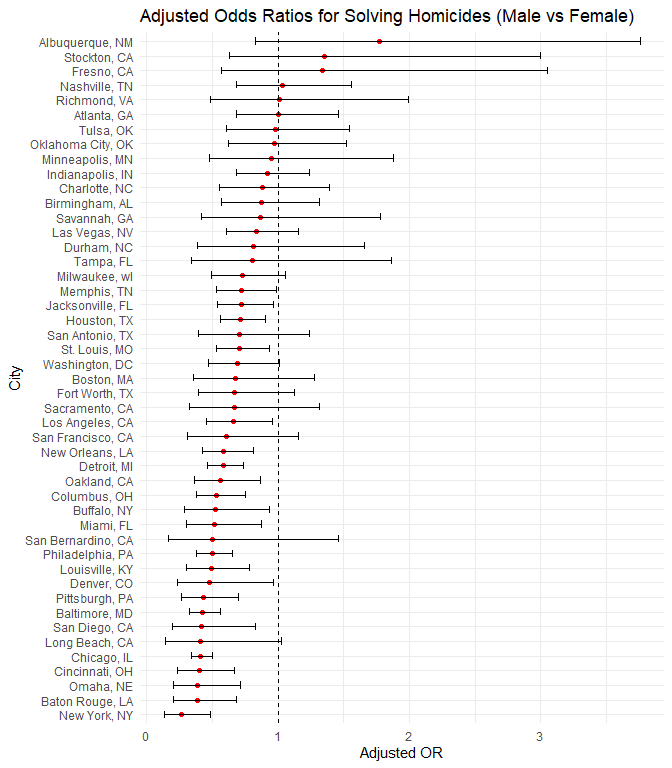
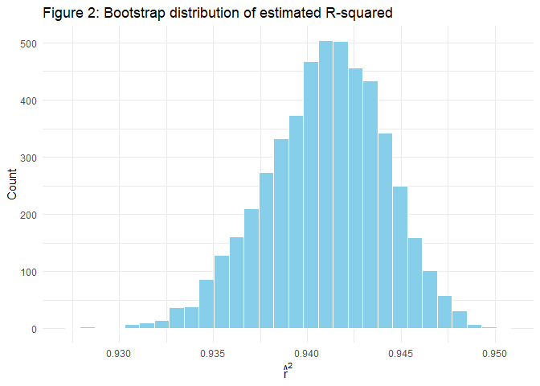
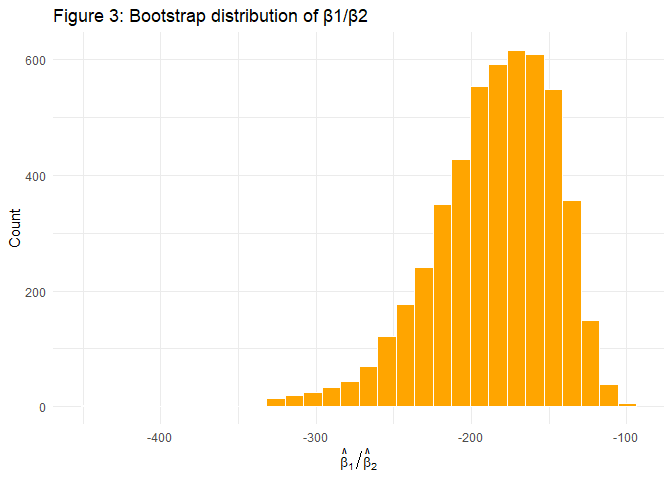
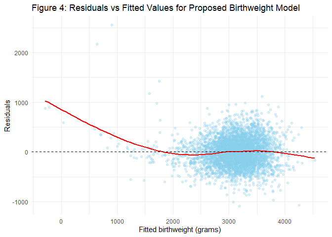

p8105_hw6_ns3923
================

**Set up necessary libraries**

``` r
library(tidyverse)
library(broom)
library(p8105.datasets)
library(modelr)
```

## Problem 1: The Washington Post - homicides

**1) Import dataset**

``` r
homicide_df = read_csv("./data/homicide-data.csv") |> 
  janitor::clean_names()

homicide_df
```

    ## # A tibble: 52,179 × 12
    ##    uid        reported_date victim_last  victim_first victim_race victim_age
    ##    <chr>              <dbl> <chr>        <chr>        <chr>       <chr>     
    ##  1 Alb-000001      20100504 GARCIA       JUAN         Hispanic    78        
    ##  2 Alb-000002      20100216 MONTOYA      CAMERON      Hispanic    17        
    ##  3 Alb-000003      20100601 SATTERFIELD  VIVIANA      White       15        
    ##  4 Alb-000004      20100101 MENDIOLA     CARLOS       Hispanic    32        
    ##  5 Alb-000005      20100102 MULA         VIVIAN       White       72        
    ##  6 Alb-000006      20100126 BOOK         GERALDINE    White       91        
    ##  7 Alb-000007      20100127 MALDONADO    DAVID        Hispanic    52        
    ##  8 Alb-000008      20100127 MALDONADO    CONNIE       Hispanic    52        
    ##  9 Alb-000009      20100130 MARTIN-LEYVA GUSTAVO      White       56        
    ## 10 Alb-000010      20100210 HERRERA      ISRAEL       Hispanic    43        
    ## # ℹ 52,169 more rows
    ## # ℹ 6 more variables: victim_sex <chr>, city <chr>, state <chr>, lat <dbl>,
    ## #   lon <dbl>, disposition <chr>

**2) Cleaning and tidying data**

- Create a city_state variable (e.g. “Baltimore, MD”), and a binary
  variable indicating whether the homicide is solved.
- Omit cities Dallas, TX; Phoenix, AZ; and Kansas City, MO (don’t report
  victim race), and omit Tulsa, AL (a data entry mistake).
- Limit those for whom victim_race is white or black, and victim_age is
  numeric.

``` r
homicide_df = homicide_df |> 
  mutate(
    city_state = str_c(city, state, sep = ", "),
    resolved   = if_else(disposition == "Closed by arrest", 1, 0),
    victim_age = as.numeric(victim_age)
  ) |> 
  
  filter(
    !city_state %in% c("Dallas, TX", "Phoenix, AZ", 
                       "Kansas City, MO", "Tulsa, AL"),
    victim_race %in% c("White", "Black")
  ) |> 
  drop_na(victim_age, victim_sex, victim_race)

##Check
homicide_df 
```

    ## # A tibble: 39,403 × 14
    ##    uid        reported_date victim_last  victim_first victim_race victim_age
    ##    <chr>              <dbl> <chr>        <chr>        <chr>            <dbl>
    ##  1 Alb-000003      20100601 SATTERFIELD  VIVIANA      White               15
    ##  2 Alb-000005      20100102 MULA         VIVIAN       White               72
    ##  3 Alb-000006      20100126 BOOK         GERALDINE    White               91
    ##  4 Alb-000009      20100130 MARTIN-LEYVA GUSTAVO      White               56
    ##  5 Alb-000016      20100308 GRAY         STEFANIA     White               43
    ##  6 Alb-000018      20100323 DAVID        LARRY        White               52
    ##  7 Alb-000019      20100402 BRITO        ELIZABETH    White               22
    ##  8 Alb-000021      20100423 KING         TEVION       Black               15
    ##  9 Alb-000022      20100423 BOYKIN       CEDRIC       Black               25
    ## 10 Alb-000023      20100518 BARRAGAN     MIGUEL       White               20
    ## # ℹ 39,393 more rows
    ## # ℹ 8 more variables: victim_sex <chr>, city <chr>, state <chr>, lat <dbl>,
    ## #   lon <dbl>, disposition <chr>, city_state <chr>, resolved <dbl>

**3) Logistic regression for Baltimore, MD**

- Use the glm function to fit a logistic regression with resolved vs
  unresolved as the outcome and victim age, sex and race as predictors.

``` r
baltimore_df = 
  homicide_df |> 
  filter(city_state == "Baltimore, MD")

baltimore_fit = 
  baltimore_df |> 
  glm(
    resolved ~ victim_age + victim_sex + victim_race,
    data   = _,
    family = binomial()
  )

baltimore_or = 
  baltimore_fit |> 
  tidy(conf.int = TRUE, exponentiate = TRUE) |> 
  filter(term == "victim_sexMale") |> 
  mutate(term = "Male vs Female (ref)") |> 
  select(term, estimate, conf.low, conf.high)

baltimore_or |> 
  knitr::kable(digits = 3)
```

| term                 | estimate | conf.low | conf.high |
|:---------------------|---------:|---------:|----------:|
| Male vs Female (ref) |    0.426 |    0.324 |     0.558 |

**Table 1: the estimated OR and 95% CI of resolved vs unresolved of male
compared to female victims**

**Explanation:** In Baltimore, MD, after adjusting for victim age and
race, homicides with male victims have lower odds of being resolved
compared to homicides with female victims (adjusted OR = 0.426; 95% CI:
0.324, 0.558). Because the confidence interval does not include 1, there
is significant evidence that cases involving male victims are less
likely to be solved.

**4) Adjusted OR and CI for solving homicides comparing male to female
victims**

``` r
city_results = 
  homicide_df |> 
  nest(data = -city_state) |> 
  mutate(
    models = map(
      data,
      ~ glm(resolved ~ victim_age + victim_sex + victim_race,
            data = ., family = binomial())
    ),
    tidy_res = map(
      models,
      ~ tidy(., conf.int = TRUE, exponentiate = TRUE)
    )
  ) |> 
  select(city_state, tidy_res) |> 
  unnest(tidy_res) |> 
  filter(term == "victim_sexMale") |> 
  rename(
    or       = estimate,
    or_lower = conf.low,
    or_upper = conf.high
  )

city_results |> 
  arrange(or) |> 
  select(city_state, or, or_lower, or_upper) |> 
  mutate(
    or       = round(or, 3),
    or_lower = round(or_lower, 3),
    or_upper = round(or_upper, 3)
  ) |> 
  knitr::kable(
    col.names = c(
      "City",
      "Adjusted OR (Male vs Female)",
      "Lower 95% CI",
      "Upper 95% CI"
    )
  )
```

| City               | Adjusted OR (Male vs Female) | Lower 95% CI | Upper 95% CI |
|:-------------------|-----------------------------:|-------------:|-------------:|
| New York, NY       |                        0.262 |        0.133 |        0.485 |
| Baton Rouge, LA    |                        0.381 |        0.204 |        0.684 |
| Omaha, NE          |                        0.382 |        0.199 |        0.711 |
| Cincinnati, OH     |                        0.400 |        0.231 |        0.667 |
| Chicago, IL        |                        0.410 |        0.336 |        0.501 |
| Long Beach, CA     |                        0.410 |        0.143 |        1.024 |
| San Diego, CA      |                        0.413 |        0.191 |        0.830 |
| Baltimore, MD      |                        0.426 |        0.324 |        0.558 |
| Pittsburgh, PA     |                        0.431 |        0.263 |        0.696 |
| Denver, CO         |                        0.479 |        0.233 |        0.962 |
| Louisville, KY     |                        0.491 |        0.301 |        0.784 |
| Philadelphia, PA   |                        0.496 |        0.376 |        0.650 |
| San Bernardino, CA |                        0.500 |        0.166 |        1.462 |
| Miami, FL          |                        0.515 |        0.304 |        0.873 |
| Buffalo, NY        |                        0.521 |        0.288 |        0.936 |
| Columbus, OH       |                        0.532 |        0.377 |        0.748 |
| Oakland, CA        |                        0.563 |        0.364 |        0.867 |
| Detroit, MI        |                        0.582 |        0.462 |        0.734 |
| New Orleans, LA    |                        0.585 |        0.422 |        0.812 |
| San Francisco, CA  |                        0.608 |        0.312 |        1.155 |
| Los Angeles, CA    |                        0.662 |        0.457 |        0.954 |
| Sacramento, CA     |                        0.669 |        0.326 |        1.314 |
| Fort Worth, TX     |                        0.669 |        0.394 |        1.121 |
| Boston, MA         |                        0.674 |        0.353 |        1.277 |
| Washington, DC     |                        0.690 |        0.465 |        1.012 |
| St. Louis, MO      |                        0.703 |        0.530 |        0.932 |
| San Antonio, TX    |                        0.705 |        0.393 |        1.238 |
| Houston, TX        |                        0.711 |        0.557 |        0.906 |
| Jacksonville, FL   |                        0.720 |        0.536 |        0.965 |
| Memphis, TN        |                        0.723 |        0.526 |        0.984 |
| Milwaukee, wI      |                        0.727 |        0.495 |        1.054 |
| Tampa, FL          |                        0.808 |        0.340 |        1.860 |
| Durham, NC         |                        0.812 |        0.382 |        1.658 |
| Las Vegas, NV      |                        0.837 |        0.606 |        1.151 |
| Savannah, GA       |                        0.867 |        0.419 |        1.780 |
| Birmingham, AL     |                        0.870 |        0.571 |        1.314 |
| Charlotte, NC      |                        0.884 |        0.551 |        1.391 |
| Indianapolis, IN   |                        0.919 |        0.678 |        1.241 |
| Minneapolis, MN    |                        0.947 |        0.476 |        1.881 |
| Oklahoma City, OK  |                        0.974 |        0.623 |        1.520 |
| Tulsa, OK          |                        0.976 |        0.609 |        1.544 |
| Atlanta, GA        |                        1.000 |        0.680 |        1.458 |
| Richmond, VA       |                        1.006 |        0.483 |        1.994 |
| Nashville, TN      |                        1.034 |        0.681 |        1.556 |
| Fresno, CA         |                        1.335 |        0.567 |        3.048 |
| Stockton, CA       |                        1.352 |        0.626 |        2.994 |
| Albuquerque, NM    |                        1.767 |        0.825 |        3.762 |

**Table 2: The adjusted OR (Male vs Female) and 95% CI for solving
homicides**

**5) Create a plot shows the estimated ORs and CIs for each city**

``` r
city_results |> 
  mutate(city_state = fct_reorder(city_state, or)) |> 
  ggplot(aes(x = city_state, y = or)) +
  geom_point(color = "red") +
  geom_errorbar(aes(ymin = or_lower, ymax = or_upper), width = 0.5) +
  geom_hline(yintercept = 1, linetype = "dashed") +
  coord_flip() +
  labs(
    title = "Figure 1: Adjusted ORs for solving homicides (Male vs Female)",
    x = "City",
    y = "Adjusted OR"
  ) +
  theme_minimal()
```

<!-- -->

**Interpretation:** Most cities have odds ratios below 1, meaning
homicides involving male victims are less likely to be solved than those
involving female victims, after adjusting for victim age and race. Only
a few cities, such as Albuquerque, NM, Stockton, CA, and Fresno, CA,
have odds ratios above 1. Still, their confidence intervals are wide, so
the results are uncertain, and we cannot be sure whether solving rates
are truly higher among male than female victims. These uncertain
exceptions may reflect a smaller population or more variable case
patterns in those cities. The lowest odds ratios are in New York, NY,
Baton Rouge, LA, and Omaha, NE. These cities show a much lower chance of
solving cases involving male victims.

## Problem 2: Central Park weather data

**1) Import data**

``` r
data("weather_df")

set.seed(123)
```

We’ll focus on a simple linear regression with `tmax` as the response
with `tmin` and `prcp` as the predictors, and are interested in the
distribution of two quantities estimated from these data:

- Estimated R-squared
- Ratio of estimated beta_1/beta_2 (β1/β2)

**2) Clean dataset**

``` r
weather_df_clean = weather_df |>
  drop_na(tmax, tmin, prcp)

n_obs = nrow(weather_df_clean)
```

**3) Create 5,000 bootstrap samples and fit the model in each sample**

``` r
weather_bootstrap = weather_df_clean |> 
  bootstrap(5000, id = "strap_id") |> 
  mutate(
    model = map(strap, ~ lm(tmax ~ tmin + prcp, data = .x)),
    glance = map(model, glance),
    tidy = map(model, tidy)
  )
```

**4) The estimated r-squared (r^2) and beta_1 and beta_2 (β1/β2)**

``` r
boot_results = weather_bootstrap |> 
  transmute(
    strap_id,
    r_sq = map_dbl(glance, "r.squared"),
    beta_1 = map_dbl(
      tidy,
      ~ .x |> 
        filter(term == "tmin") |> 
        pull(estimate)
    ),
    beta_2 = map_dbl(
      tidy,
      ~ .x |> 
        filter(term == "prcp") |> 
        pull(estimate)
    ),
    beta_ratio = beta_1 / beta_2
  )

boot_results
```

    ## # A tibble: 5,000 × 5
    ##    strap_id  r_sq beta_1   beta_2 beta_ratio
    ##    <chr>    <dbl>  <dbl>    <dbl>      <dbl>
    ##  1 0001     0.936   1.00 -0.00636      -158.
    ##  2 0002     0.939   1.02 -0.00469      -217.
    ##  3 0003     0.943   1.02 -0.00642      -159.
    ##  4 0004     0.946   1.03 -0.00523      -196.
    ##  5 0005     0.941   1.02 -0.00718      -142.
    ##  6 0006     0.941   1.01 -0.00714      -142.
    ##  7 0007     0.942   1.01 -0.00831      -122.
    ##  8 0008     0.940   1.01 -0.00723      -140.
    ##  9 0009     0.940   1.01 -0.00521      -194.
    ## 10 0010     0.939   1.02 -0.00483      -212.
    ## # ℹ 4,990 more rows

**5) Plot the distribution of the estimates r-squared and beta1/beta2
(β1/β2)**

``` r
boot_results |> 
  ggplot(aes(x = r_sq)) +
  geom_histogram(bins = 30, fill = "skyblue", color = "white") +
  labs(
    title = "Figure 2: Bootstrap distribution of estimated R-squared",
    x = expression(hat(r)^2),
    y = "Count"
  ) +
  theme_minimal()
```

<!-- -->

``` r
boot_results |> 
  ggplot(aes(x = beta_ratio)) +
  geom_histogram(bins = 30, fill = "orange", color = "white") +
  labs(
    title = "Figure 3: Bootstrap distribution of β1/β2",
    x = expression(hat(beta)[1] / hat(beta)[2]),
    y = "Count"
  ) +
  theme_minimal()
```

<!-- -->

**Explanation:** The bootstrap distribution of the estimated R-squared
is centered around 0.94, indicating the model consistently explains most
of the variation in `tmax` across samples. In addition, the distribution
of the ratio β1/β2 is entirely negative and more spread out. This
happens because `tmin` has a strong positive effect on `tmax`, while
`prcp` has a small negative effect. Overall, this shows that the effect
of `tmin` is very stable, but the small size of the `prcp` coefficient
leads to more variability in the ratio.

**6) Identify the 2.5% and 97.5% quantiles to provide a 95% confidence
interval for R-squared and β1/β2**

``` r
boot_ci =
  boot_results |>
  summarize(
    r_sq_lower  = quantile(r_sq, 0.025),
    r_sq_upper  = quantile(r_sq, 0.975),
    ratio_lower = quantile(beta_ratio, 0.025),
    ratio_upper = quantile(beta_ratio, 0.975)
  )

boot_ci |> 
  knitr::kable(digits = 3,
               col.names = c(
                 "R² lower",
                 "R² upper",
                 "β₁/β₂ lower",
                 "β₁/β₂ upper"
               ))
```

| R² lower | R² upper | β₁/β₂ lower | β₁/β₂ upper |
|---------:|---------:|------------:|------------:|
|    0.934 |    0.947 |     -277.17 |    -125.706 |

**Table 3: The lower and upper bound of R-squared and β1/β2**

**Explanation:** The 2.5% and 97.5% bootstrap quantiles for R-squared
are 0.934 and 0.947, respectively. The 95% confidence interval of
R-squared is (0.934, 0.947). This narrow interval shows that the model
is stable and consistently explains more than 93% of the variation in
`tmax`. For the ratio β1/β2, the 2.5% and 97.5% quantiles are -277.17
and -125.71, resulting in a 95% confidence interval of (–277.17 to
–125.71), which is entirely negative. This indicates that `tmin` has a
strong positive effect on `tmax`, while `prcp` has a small negative
effect across samples.

## Problem 3: Birthweight

**1) Import dataset**

``` r
bw_df = read_csv("./data/birthweight.csv") |> 
  janitor::clean_names()

bw_df |> glimpse()
```

    ## Rows: 4,342
    ## Columns: 20
    ## $ babysex  <dbl> 2, 1, 2, 1, 2, 1, 2, 2, 1, 1, 2, 1, 2, 1, 1, 2, 1, 2, 2, 2, 1…
    ## $ bhead    <dbl> 34, 34, 36, 34, 34, 33, 33, 33, 36, 33, 35, 35, 35, 36, 35, 3…
    ## $ blength  <dbl> 51, 48, 50, 52, 52, 52, 46, 49, 52, 50, 51, 51, 48, 53, 51, 4…
    ## $ bwt      <dbl> 3629, 3062, 3345, 3062, 3374, 3374, 2523, 2778, 3515, 3459, 3…
    ## $ delwt    <dbl> 177, 156, 148, 157, 156, 129, 126, 140, 146, 169, 130, 146, 1…
    ## $ fincome  <dbl> 35, 65, 85, 55, 5, 55, 96, 5, 85, 75, 55, 55, 75, 75, 65, 75,…
    ## $ frace    <dbl> 1, 2, 1, 1, 1, 1, 2, 1, 1, 2, 1, 1, 1, 1, 1, 2, 1, 1, 1, 2, 1…
    ## $ gaweeks  <dbl> 39.9, 25.9, 39.9, 40.0, 41.6, 40.7, 40.3, 37.4, 40.3, 40.7, 4…
    ## $ malform  <dbl> 0, 0, 0, 0, 0, 0, 0, 0, 0, 0, 0, 0, 0, 0, 0, 0, 0, 0, 0, 0, 0…
    ## $ menarche <dbl> 13, 14, 12, 14, 13, 12, 14, 12, 11, 12, 13, 12, 13, 11, 12, 1…
    ## $ mheight  <dbl> 63, 65, 64, 64, 66, 66, 72, 62, 61, 64, 67, 62, 64, 68, 62, 6…
    ## $ momage   <dbl> 36, 25, 29, 18, 20, 23, 29, 19, 13, 19, 23, 16, 28, 23, 21, 1…
    ## $ mrace    <dbl> 1, 2, 1, 1, 1, 1, 2, 1, 1, 2, 1, 1, 1, 1, 1, 2, 1, 1, 1, 2, 1…
    ## $ parity   <dbl> 3, 0, 0, 0, 0, 0, 0, 0, 0, 0, 0, 0, 0, 0, 0, 0, 0, 0, 0, 0, 0…
    ## $ pnumlbw  <dbl> 0, 0, 0, 0, 0, 0, 0, 0, 0, 0, 0, 0, 0, 0, 0, 0, 0, 0, 0, 0, 0…
    ## $ pnumsga  <dbl> 0, 0, 0, 0, 0, 0, 0, 0, 0, 0, 0, 0, 0, 0, 0, 0, 0, 0, 0, 0, 0…
    ## $ ppbmi    <dbl> 26.27184, 21.34485, 23.56517, 21.84508, 21.02642, 18.60030, 1…
    ## $ ppwt     <dbl> 148, 128, 137, 127, 130, 115, 105, 119, 105, 145, 110, 115, 1…
    ## $ smoken   <dbl> 0.000, 0.000, 1.000, 10.000, 1.000, 0.000, 0.000, 0.000, 0.00…
    ## $ wtgain   <dbl> 29, 28, 11, 30, 26, 14, 21, 21, 41, 24, 20, 31, 23, 21, 24, 2…

**2) Clean dataset**

- Convert baby’s sex (`babysex`) and presence of malformation status
  (`malform`) to factors with descriptive labels.
- Convert maternal (`mrace`) and father’s race (`frace`) as categorical
  variables.
- Check for missing values across all variables.

``` r
bw_df =
  bw_df |>
  mutate(
    babysex = factor(babysex, labels = c("male", "female")),
    malform = factor(malform, labels = c("absent", "present")),
    mrace   = factor(mrace),
    frace   = factor(frace)
  )

bw_df |> summarize(across(everything(), ~ sum(is.na(.))))
```

    ## # A tibble: 1 × 20
    ##   babysex bhead blength   bwt delwt fincome frace gaweeks malform menarche
    ##     <int> <int>   <int> <int> <int>   <int> <int>   <int>   <int>    <int>
    ## 1       0     0       0     0     0       0     0       0       0        0
    ## # ℹ 10 more variables: mheight <int>, momage <int>, mrace <int>, parity <int>,
    ## #   pnumlbw <int>, pnumsga <int>, ppbmi <int>, ppwt <int>, smoken <int>,
    ## #   wtgain <int>

**Check:** There is no missing data. So, the full dataset was used in
subsequent analyses without additional cleaning or imputation.

**3) Proposed regression model**

Based on biological and clinical factors known to influence fetal growth
and birthweight, I selected the following variables for the proposed
regression model:

- `bhead`: baby’s head circumference at birth (centimeters)
- `blength`: baby’s length at birth (centimeters)
- `gaweeks`: gestational age in weeks
- `wtgain`: mother’s weight gain during pregnancy (pounds)
- `smoken`: average number of cigarettes smoked per day during pregnancy
- `momage`: mother’s age at delivery (years)

These variables reflect established determinants of fetal growth in
obstetric and pediatric research. The model was fit using linear
regression with birthweight (`bwt`) as the outcome.

``` r
bw_regfit = bw_df |>
  lm(
    bwt ~ bhead + blength + gaweeks + wtgain + smoken + momage,
    data = _
  )

bw_regfit |> tidy()
```

    ## # A tibble: 7 × 5
    ##   term        estimate std.error statistic   p.value
    ##   <chr>          <dbl>     <dbl>     <dbl>     <dbl>
    ## 1 (Intercept) -6127.      96.5      -63.5  0        
    ## 2 bhead         135.       3.50      38.6  4.63e-280
    ## 3 blength        79.5      2.07      38.5  5.04e-279
    ## 4 gaweeks        13.2      1.50       8.82 1.57e- 18
    ## 5 wtgain          3.84     0.404      9.50 3.46e- 21
    ## 6 smoken         -2.37     0.583     -4.07 4.86e-  5
    ## 7 momage          7.44     1.13       6.61 4.35e- 11

``` r
#model residuals against fitted value
bw_resid_df = bw_df |>
  add_predictions(bw_regfit) |>
  add_residuals(bw_regfit)

bw_resid_df |>
  ggplot(aes(x = pred, y = resid)) +
  geom_point(alpha = 0.3, color = "skyblue") +
  geom_smooth(se = FALSE, color = "red") +
  geom_hline(yintercept = 0, linetype = "dashed") +
  labs(
    title = "Figure 4: Residuals vs Fitted Values for Proposed Birthweight Model",
    x = "Fitted birthweight (grams)",
    y = "Residuals"
  ) +
  theme_minimal()
```

<!-- -->

**Explanation:** From the plot, the residuals are centered around the
zero line across the range of fitted birthweights, but the red trend
line shows a slight curved pattern, especially at lower fitted values.
This suggests that the linearity assumption is mostly reasonable,
although the model may miss some mild non-linear structure. The spread
of the residuals increases slightly at higher fitted values, but there
is no strong evidence of heteroscedasticity or major violations of model
assumptions. Overall, the residual plot suggests that the model fits the
data adequately, with only minor deviations from ideal linearity.

**4) Compare the proposed model to two others:**

- One using length at birth and gestational age as predictors (main
  effects only)
- One using head circumference, length, sex, and all interactions
  (including the three-way interaction) between these

*Model 1: The proposed regression model*

``` r
model_1 = lm(bwt ~ bhead + blength + gaweeks + wtgain + smoken + momage, data = bw_df)
```

*Model 2: Main effect only (length of birth and gestational age)*

``` r
model_2 = lm(bwt ~ blength + gaweeks, data = bw_df)
```

*Model 3: Head circumference, length, sex, and all interactions (2-way
and 3 -way interactions)*

``` r
model_3 = lm(bwt ~ bhead * blength * babysex, data = bw_df)
```

Make this comparison in terms of the cross-validated prediction error by
using `crossv_mc` and functions in purrr as appropriate.

``` r
set.seed(123)

cv_df = 
  crossv_mc(bw_df, n = 100)

cv_results =
  cv_df |> 
  mutate(
    mod_A = map(train, ~ lm(bwt ~ bhead + blength + gaweeks + wtgain + smoken + momage, data = .x)),
    mod_B = map(train, ~ lm(bwt ~ blength + gaweeks, data = .x)),
    mod_C = map(train, ~ lm(bwt ~ bhead * blength * babysex, data = .x)),
    
    rmse_A = map2_dbl(mod_A, test, ~ rmse(model = .x, data = .y)),
    rmse_B = map2_dbl(mod_B, test, ~ rmse(model = .x, data = .y)),
    rmse_C = map2_dbl(mod_C, test, ~ rmse(model = .x, data = .y))
  )

cv_results |>
  summarize(
    rmse_A = mean(rmse_A),
    rmse_B = mean(rmse_B),
    rmse_C = mean(rmse_C)
  ) |> 
  knitr::kable(digits = 2,
  col.names = c("Proposed model",
              "Main effect only",
              "2- and 3-way interactions of head x length x sex"
                ))
```

| Proposed model | Main effect only | 2- and 3-way interactions of head x length x sex |
|---:|---:|---:|
| 282.38 | 330.71 | 288.38 |

**Table 4: Root Mean Squared Error (RMSE) showing the average size of
the prediction error between the model-predicted birthweight and the
true birthweight**

**Explanation:** The main-effects model performs the worst, with an RMSE
of 330.71 grams, suggesting that relying on these two main predictors
alone does not capture enough variation in birthweight. The interaction
model performs better than the main-effects model but slightly worse
than the proposed model (RMSE = 288.38 grams). In contrast, the proposed
model has the lowest average cross-validated RMSE at 282.38 grams. This
indicates that it provides the most accurate birthweight predictions
among the three models.
